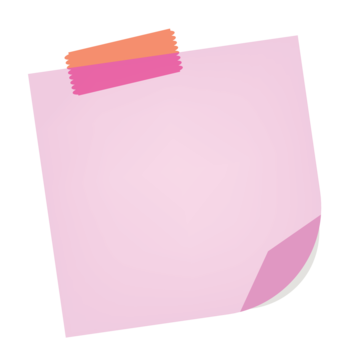

[![LinkedIn][linkedin-shield]][linkedin-url]

<!-- PROJECT LOGO -->
 

  

<h3 align="center">FloatDocs</h3>

  

    FloatDocs is an innovative task management tool that reimagines the traditional to-do list. Each task is represented as a sticky note, which can be freely dragged and placed anywhere on the screen. This dynamic interface provides an interactive and visually engaging way to organize and manage your tasks.
     
     
     
    <a href="https://float-docs.vercel.app/">View Demo</a>
  

<!-- ABOUT THE PROJECT -->
## About The Project

[![Product Name Screen Shot][product-screenshot]](https://float-docs.vercel.app/)

* **Sticky Note Tasks:** Each task behaves like a movable sticky note.
* **Drag-and-Drop:** Freely drag and place notes anywhere on the screen.
* **Interactive Interface:** Offers a visually engaging and dynamic task management experience.
* **Customizable Layout:** Arrange tasks in any way that suits your workflow.
* **Perfect for Creatives:** Ideal for brainstorming, task organization, and more.

### Built With

* React.js
* Tailwind CSS
* Framer Motion

<!-- CONTACT -->
## Contact

Gmail - devanuragbansal@gmail.com

Project Link: [https://github.com/anuragbansall/FloatDocs](https://github.com/anuragbansall/FloatDocs)

<!-- MARKDOWN LINKS & IMAGES -->
[linkedin-shield]: https://img.shields.io/badge/-LinkedIn-black.svg?style=for-the-badge&logo=linkedin&colorB=555
[linkedin-url]: https://linkedin.com/in/anuragbansall
[product-screenshot]: ./public/product-demo.png
